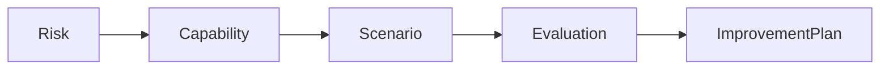

# Межі контекстів

| Контекст | Відповідальність |
| --- | --- |
| Core | громади, ролі, організації, доступ |
| Risk | небезпеки, уразливості, ризики та докази |
| Preparedness | виміри готовності, CPMM, CPP |
| Simulation | сценарії, inject, рішення, AAR |
| Evaluation | критерії, спроможності, висновки |
| Improvement | дії, власники, строки, індикатори |

