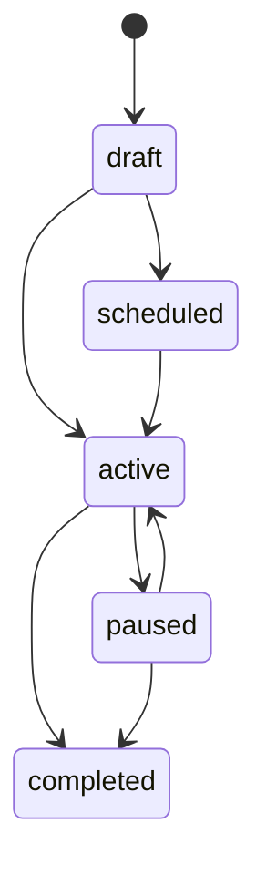
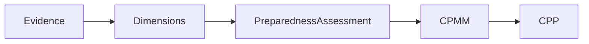

# Словник даних Sprint 1

| Сутність | Ключові дані | Призначення |
| --- | --- | --- |
| Community | code, oblast, population | контекст кореневого агрегату |
| Risk | scores, evidence, confidence | документована оцінка ризику |
| PreparednessAssessment | dimensions, evidence, maturity | профіль готовності |
| Scenario | hazards, injects, objectives | версіонований навчальний сценарій |
| Simulation | status, timeline, decisions | проведення сесії |
| Evaluation | criteria, gaps, findings | навчальні висновки |
| ImprovementPlan | actions, deadlines, indicators | відстеження покращень |

| CommunityMap / MapLayer / GeoFeature | межі, шари, GeoJSON, атрибуція | геопросторовий контекст громади |
