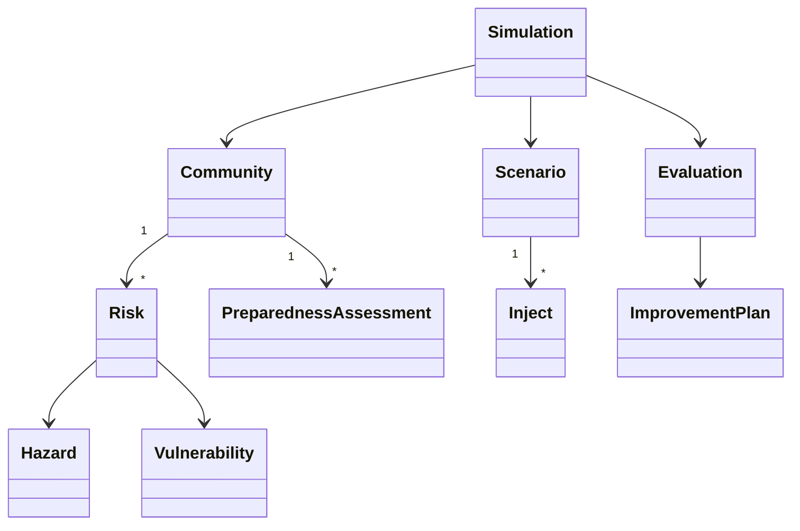

# Доменна модель TPS360

Sprint 1 реалізує типізовану модель Community як кореня агрегату, з Risk, Capability, PreparednessAssessment, Scenario, Simulation, Evaluation і ImprovementPlan. Розрахунки ізольовані в сервісах і не є затвердженою методологією.

