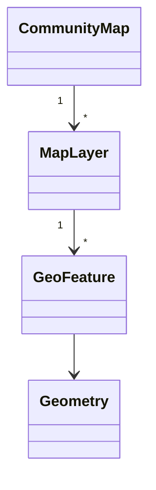

# Geospatial Core Model

Geospatial Context зберігає версіоновану карту громади без UI чи зовнішніх запитів. CommunityMap містить межу, атрибуцію та шари; MapLayer містить GeoFeature; value objects надають GeoJSON-сумісні координати й геометрії.

Карта активується лише з межею та атрибуцією. Рівні public, operational, restricted і sensitive обмежують видимість; public serialization виключає неpublic шари й властивості. MVP не виконує просторових перетинів, маршрутизації або імпорту OSM.

