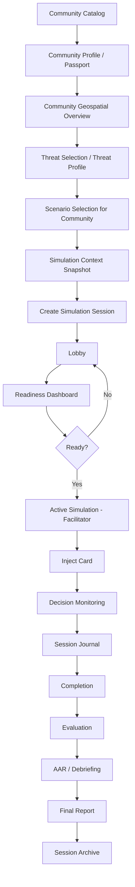
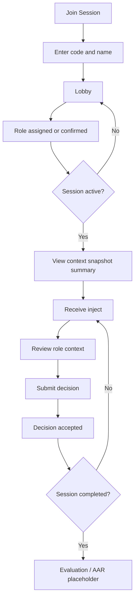

# TPS360 User Flows

Status: draft UX architecture. Scope: product and interaction design only.

## Canonical community-first flow

Community Catalog -> Community Selection -> Community Profile / Passport -> Community Geospatial Overview -> Threat Selection / Threat Profile -> Scenario Selection for Community -> Simulation Context Snapshot -> Create Simulation Session -> Lobby and Readiness -> Active Simulation -> Evaluation -> AAR / Debriefing -> Final Report -> Archive.

This is the agreed end-to-end logic. Scenario selection is not the first product step. Bereznehuvatska community is a test/example fixture only.

## Session state mapping

| Product state | Current code/API state | Notes |
|---|---|---|
| created | No separate observed state | `POST /sessions` creates a session directly in a lobby-like state. |
| lobby | `LOBBY` | Participants can join while capacity remains. |
| ready | `READY` | Session is ready to start after readiness rules are satisfied. |
| active | `ACTIVE` | Facilitator can send injects and participants can submit decisions. |
| completed | `COMPLETED` | Active runtime has ended. |
| debriefing | Not implemented | PRODUCT DECISION REQUIRED and API missing. |
| archived | Not implemented | PRODUCT DECISION REQUIRED and API missing. |
| cancelled | `CANCELLED` | Present in code, not in the requested product-state list. |

## Facilitator flow

Goal: select a community context, choose a relevant threat/scenario, create and run a session, then hand off to evaluation/AAR/reporting.

MVP flow:

1. Enter facilitator area.
2. Open Community Catalog.
3. Select a community.
4. Review Community Profile / Passport.
5. Review Community Geospatial Overview.
6. Select or assess threat.
7. Select scenario for the selected community and threat.
8. Review Simulation Context Snapshot.
9. Create simulation session.
10. Receive join code or join instructions.
11. Manage lobby.
12. Assign or verify participant roles.
13. Check readiness.
14. Start active simulation.
15. Send inject event.
16. Monitor participant decisions.
17. Review session journal.
18. Send further injects if needed. PRODUCT DECISION REQUIRED: exact round/event structure is not defined.
19. Complete active simulation.
20. Move to evaluation and AAR / Debriefing when those products are defined.
21. Generate final report and archive when APIs exist.

Facilitator PRODUCT DECISION REQUIRED:

- Authentication and facilitator identity.
- Facilitator token storage, display, recovery, and expiry behavior.
- Real-time transport: polling, SSE, or WebSocket.
- Role taxonomy and role assignment policy.
- Readiness rules and whether facilitator can override them.
- Inject lifecycle: draft, send, edit, cancel, close.
- Whether decisions are shown immediately, after all participants respond, or by facilitator reveal.
- Round structure, timing, and transitions, if any.
- Evaluation criteria and ownership.
- AAR / Debriefing structure.
- Final report content, approval, and export formats.

## Participant flow

Goal: join a session connected to a community/scenario context, understand role context, receive injects, and submit decisions.

MVP flow:

1. Open Join Session.
2. Enter join code or session link.
3. Enter participant name. PRODUCT DECISION REQUIRED: identity/reconnect model.
4. Join lobby.
5. Receive or confirm role.
6. Wait for readiness and start.
7. See compact community/scenario context derived from Simulation Context Snapshot.
8. Receive active inject.
9. Review role information and required action.
10. Submit decision for the inject.
11. See accepted/duplicate/error confirmation.
12. Wait for next inject or completion. PRODUCT DECISION REQUIRED: exact round/event structure is not defined.
13. Participate in evaluation or AAR when defined.

Participant PRODUCT DECISION REQUIRED:

- Whether participants can self-select, request, or only receive roles.
- Whether submitted decisions can be edited before an event closes.
- Whether participant sees other participants or only aggregate status.
- Participant reconnect and duplicate identity behavior.
- Participant access to evaluation/AAR.

## Administrator flow

Administrator scope should stay minimal for MVP and follow the community-first model.

| Function | MVP recommendation | Rationale |
|---|---|---|
| Community catalog administration | PRODUCT DECISION REQUIRED | The product flow begins with communities, but management ownership is not defined. |
| Community passport data | PRODUCT DECISION REQUIRED | Needs source-of-truth and update workflow. |
| Geospatial layers | PRODUCT DECISION REQUIRED | Needs data governance and map source decisions. |
| Threat catalog/profile | PRODUCT DECISION REQUIRED | Needed for selection/evaluation but API is incomplete. |
| Scenario library | Include basic management if reusable scenarios are required | Facilitators need a reliable scenario source. |
| Users and organizations | Defer or keep minimal | Auth and organization model are not defined. |
| Facilitators | Include only if access control is implemented | Tokens alone are not account administration. |
| Session archive | Read-only after reporting exists | Useful for evidence and learning history. |
| System settings | Defer | No confirmed MVP-critical need. |

Admin MVP flow, pending product decisions:

1. Manage or verify Community Catalog.
2. Manage community passport data source if product owner assigns this to TPS360.
3. Manage threat/scenario catalog metadata.
4. Review active/completed sessions.
5. Manage facilitator access only after auth exists.
6. Archive/export only after report model exists.

## Data handoff across the flow

| From | To | Data passed |
|---|---|---|
| Community Catalog | Community Profile / Passport | `community_id`, name, administrative metadata. |
| Community Profile / Passport | Geospatial Overview | `community_id`, settlements/assets/population/risk-relevant profile data if available. |
| Geospatial Overview | Threat Selection | Community geography and exposed assets. |
| Threat Selection | Scenario Selection | Selected threat/risk type and severity assumptions. |
| Scenario Selection | Simulation Context Snapshot | `community_id`, `threat_id` or risk input, `scenario_id`, preparedness profile references. |
| Simulation Context Snapshot | Create Session | Scenario and context snapshot selected for the run. |
| Create Session | Lobby | `session_id`, join code/link, facilitator token, capacity/role rules if present. |
| Lobby | Readiness | Participants, assigned roles, readiness blockers. |
| Readiness | Active Simulation | `session_id`, participants, roles, selected context. |
| Active Simulation | Evaluation/AAR | Injects, decisions, journal, completion state. |
| Evaluation/AAR | Final Report | Scores, notes, timeline, findings, recommendations. |
| Final Report | Archive | Completed report, session metadata, access rules. |

## Cross-role dependencies

| Dependency | Why it matters |
|---|---|
| Community Catalog API | First screen of the product flow. |
| Community Profile / Passport read model | Needed before threat/scenario selection. |
| Geospatial data contract | Needed for map overview and context. |
| Threat catalog/profile contract | Needed before scenario selection. |
| Simulation Context Snapshot contract | Needed as stable handoff into sessions. |
| Authentication model | Needed for facilitator/admin separation. |
| Real-time update model | Needed for lobby and active session UX. |
| Role taxonomy | Needed for role cards and decision attribution. |
| Debrief/evaluation/report model | Needed before post-session UX is designed in detail. |
